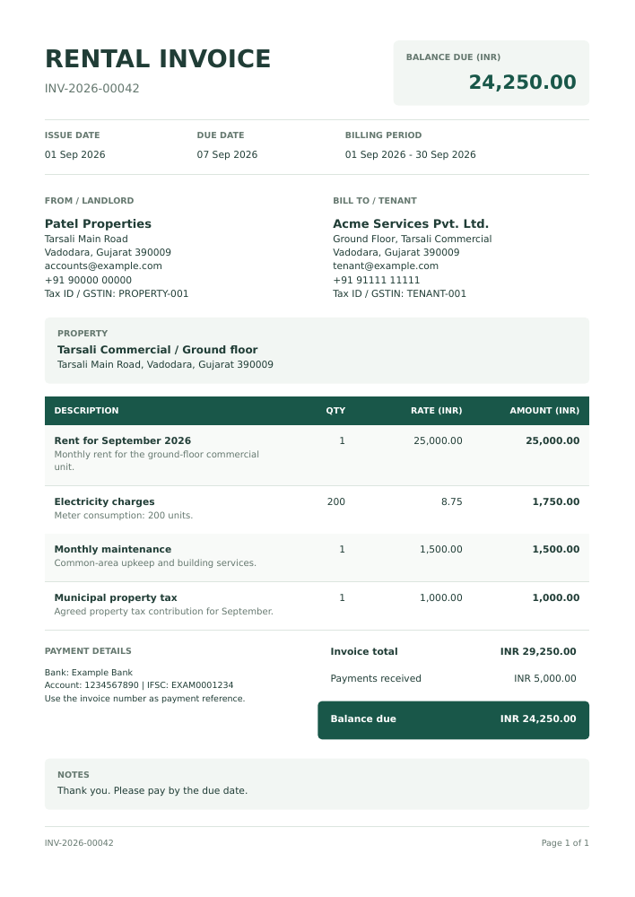

# Rentfolio — Rental invoices portal

A small, self-hosted portal for managing one or more landlord identities from a single administrator login. Keep each landlord's properties, tenants, invoices and recurring billing separate while using one lightweight deployment. **Email is optional and off by default.**

## Stack

- **Node.js 24 + Fastify**: one application process serves the API and built frontend.
- **Preact + Vite**: a responsive browser interface, approximately 23 KB of compressed JavaScript and CSS in the initial build.
- **SQLite** through Node's built-in driver, with WAL journaling and foreign keys. No separate database server.
- **PDFKit**: PDFs generated in-process; no Chromium/Puppeteer in production.
- **Nodemailer**: optional SMTP delivery with a durable SQLite queue.
- One Docker container, one persistent data volume. No nginx, Redis, external cron service or background worker container required.

## Included

- Private administrator login; password change and session revocation.
- Multiple landlord profiles, each with its own identity, contact details, tax identifier, bank/UPI instructions, currency, unique invoice prefix, independent invoice-number series and billing time zone.
- A profile switcher that scopes the dashboard, properties, tenants, invoices, recurring billing and email delivery history to the selected landlord.
- Direct URLs for every main section and invoice detail, so pages can be refreshed, bookmarked and shared between signed-in administrators.
- Property/unit records assigned to a landlord profile, plus tenant contact details, default rent, deposit and lease dates; edit or archive records.
- Manual invoices with multiple items: rent, electricity, maintenance, municipal property tax, water and other charges.
- Weekly, monthly and yearly recurring schedules, pause/resume, end dates, due dates and optional automatic email.
- Dynamic item titles, descriptions and notes using billing-period tokens.
- Structured A4 invoice PDFs with landlord/tenant details, a property section, itemized quantity/rate/amount columns, totals, payment instructions and page numbers. Long content flows across pages with repeated table headers. PDF downloads work from invoice lists and details regardless of SMTP configuration.
- The same PDF renderer serves downloads and optional email attachments. Previously issued invoices use the updated layout when downloaded again; their stored billing details are unchanged.
- Optional manual email or automatic email with PDF attached; delivery history, failures and retry controls.
- Partial/full payment recording, correction of payment records, overdue tracking, search and status filtering.
- Invoice editing: update dates, tenant, charges and notes on the same invoice number while refreshing its landlord, tenant and property snapshot from current records.
- Historical snapshots: changing a tenant, property, currency or landlord profile does not silently rewrite issued invoices; details refresh only when an invoice is explicitly edited.
- Docker configuration, health check, online backup and password-recovery scripts, automated tests and GitHub Actions CI.

## Production with Docker

1. Check out the project and create the environment file:

   ```sh
   git clone https://github.com/ankur2194/rental-invoices.git
   cd rental-invoices
   # If the implementation PR has not been merged yet:
   git checkout codex/rental-portal
   cp .env.example .env
   ```

2. Edit `.env`:

   ```dotenv
   APP_URL=https://rent.your-domain.com
   HOST_PORT=3080
   BIND_ADDRESS=127.0.0.1
   PORT=3000
   NODE_ENV=production
   COOKIE_SECURE=true
   DB_PATH=/app/data/rental.sqlite
   ADMIN_EMAIL=you@example.com
   ADMIN_PASSWORD=your-unique-long-random-password
   ```

   Use a strong password of at least 12 characters. `ADMIN_EMAIL` and `ADMIN_PASSWORD` bootstrap the first administrator **only when the database is empty**. Changing those variables later does not change the existing account. Use the profile screen or password recovery script instead. Protect `.env` and exclude it from version control.

3. Start:

   ```sh
   docker compose up -d --build
   docker compose logs -f app
   ```

4. In your **existing nginx**, proxy the chosen HTTPS hostname to `http://127.0.0.1:3080` (or your configured `HOST_PORT`). Forward the original `Host`, `X-Forwarded-For`, and `X-Forwarded-Proto` headers. `APP_URL` must exactly match the browser origin, including a nonstandard HTTPS port if used. The app lives at the hostname root, not a subdirectory. HTTPS is required for production login cookies.

   If nginx is in another container, use a shared Docker network and proxy to the application's internal port, or configure an appropriate reachable bind address and firewall. `TRUST_PROXY` accepts a specific trusted proxy IP/CIDR; leave it empty unless configured deliberately. Otherwise rate limiting sees nginx's address and is shared across users.

5. Open the HTTPS URL and sign in using your configured administrator account.

The named `rental_data` volume persists the SQLite database across container replacements. **Do not use `docker compose down -v` unless you intend to delete your data.** Run exactly one application replica against this volume. SQLite storage must be on local disk, not NFS/network storage.

`HOST_PORT` controls the exported host port; `PORT` controls the internal application port. No nginx container is included. The app runs as the unprivileged `node` user, with a read-only root filesystem and dropped Linux capabilities. Start with a small VPS/container allocation and measure your workload; no fixed resource limit is imposed.

## Production with PM2 (without Docker)

The portal can run directly on your server with PM2. Install **Node.js 24 with npm**, **PM2**, and the project dependencies. SQLite is built into Node.js; no database server, Redis, external cron service, Chromium or native SQLite library is needed. Your existing nginx can handle HTTPS.

### Install and build

Run the application as a regular deployment user with write access to its data directory. Install PM2:

```sh
npm install -g pm2
```

DejaVu Sans regular and bold are bundled in `assets/fonts/` and embedded in generated PDFs. No operating-system font package is required, including on Raspberry Pi / Ubuntu. Preserve this folder when deploying. Other languages may need compatible font files configured through `PDF_FONT_REGULAR` and `PDF_FONT_BOLD`; bundled font licensing is in `assets/fonts/LICENSE.txt`.

Clone the repository if needed, or enter your existing checkout:

```sh
git clone https://github.com/ankur2194/rental-invoices.git
cd rental-invoices
# Only while the implementation PR is unmerged:
git checkout codex/rental-portal
npm ci --include=dev
npm run build
# For a fresh installation only; do not overwrite an existing .env:
cp .env.example .env
```

Build dependencies are required for `npm run build`; they do not run as separate services.

### Configure the environment

Edit `.env` in the project root:

```dotenv
NODE_ENV=production
APP_URL=https://rent.your-domain.com
PORT=3080
COOKIE_SECURE=true
DB_PATH=./data/rental.sqlite
ADMIN_EMAIL=you@example.com
ADMIN_PASSWORD=your-unique-long-random-password
TRUST_PROXY=127.0.0.1
SMTP_HOST=
SMTP_FROM=
```

`TRUST_PROXY=127.0.0.1` assumes nginx connects from the same host over IPv4 loopback. Adjust it to the actual trusted proxy address if different. Use a unique password of at least 12 characters; administrator credentials only initialize an empty database. Leave SMTP empty for PDF-only use.

Use `PORT` for PM2 deployments. `HOST_PORT` and `BIND_ADDRESS` are Docker Compose settings and have no effect here. The application listens on all interfaces, so restrict direct access to that port with your server firewall and serve the portal through nginx. Point your existing HTTPS nginx configuration to `http://127.0.0.1:3080`, forwarding `Host`, `X-Forwarded-For` and `X-Forwarded-Proto`. The browser origin must match `APP_URL`.

The data directory is created automatically and must be writable by the deployment user. The relative `DB_PATH` is resolved from the project directory; use an absolute path if you move or replace deployment directories. Keep `.env` and the data directory private to that user.

### Start and enable reboot recovery

From the project root:

```sh
pm2 start npm --name rental-invoices --kill-timeout 60000 -- start
pm2 status
pm2 logs rental-invoices
```

The npm start script loads `.env` automatically. Run **one instance in fork mode only**; do not enable cluster mode, `-i max`, or a second Docker instance against the same database. Recurring billing and the optional email queue run inside this process.

Enable startup recovery:

```sh
pm2 startup
# Execute the system-specific command printed by PM2, then:
pm2 save
```

Run PM2 commands as the same deployment user. If you upgrade Node.js or change its installation path, regenerate PM2's startup configuration as described in the [PM2 startup documentation](https://pm2.keymetrics.io/docs/usage/startup/).

### Updates and maintenance

For a simple deployment with a short maintenance window:

```sh
pm2 stop rental-invoices
git pull --ff-only
npm ci --include=dev
npm run build
# Restart only after installation and build succeed:
pm2 restart rental-invoices --update-env
pm2 save
```

After changing only `.env`, run `pm2 restart rental-invoices --update-env`. Environment values already exported in the shell or PM2 take precedence over `.env`; avoid conflicting definitions. Preserve the data directory and `.env` during updates.

When upgrading, take a backup before stopping the old process. Transactional SQLite migrations run automatically on the first start. A single-profile database keeps its existing landlord as the first profile and assigns existing properties and invoices to it. The invoice-editing migration removes the obsolete recreation link only; any original and replacement invoices already created by the previous release remain intact. The invoice-series migration renumbers existing invoices from `00001` independently for each landlord, in their original creation order, and then continues that landlord's counter. If profiles shared a prefix, the first keeps it and later profiles receive a unique suffix such as `INV-2`. Tenant, payment, recurring schedule, email and historical snapshot data remain unchanged. No manual SQL or new environment variable is required.

To create a consistent backup from the project root:

```sh
mkdir -p backups
npm run backup -- ./backups/rental-backup.sqlite
```

Use timestamped filenames for successive backups. For password recovery, use `npm run reset-password -- you@example.com < /secure/new-password.txt`. Both scripts load `.env`; see the backup and recovery sections below for data-handling details.

## Optional SMTP email

Leave `SMTP_HOST` and `SMTP_FROM` empty for a PDF-only portal. To enable email, configure:

```dotenv
SMTP_HOST=smtp.example.com
SMTP_PORT=587
SMTP_SECURE=false
SMTP_USER=your-smtp-user
SMTP_PASSWORD=your-smtp-password
SMTP_FROM=Your Property Office <billing@example.com>
```

Port 587 uses required STARTTLS. For implicit TLS on port 465 set `SMTP_SECURE=true`. Certificates are verified. Restart the application after environment changes using the command for your deployment:

```sh
# Docker:
docker compose up -d --force-recreate
# Or PM2:
pm2 restart rental-invoices --update-env
```

Enabling SMTP alone does **not** send invoices. Select the optional email checkbox when creating an invoice or recurring schedule, or click **Send email** on an invoice. The **Send email** recipient comes from the tenant snapshot saved with that invoice. Choose **Send email to…** to enter another recipient and send the PDF to that address instead, even when the invoice has no tenant email. This does not change the saved tenant email or recurring billing settings. The recipient appears in email history. Pending sends to the same address are deduplicated; different recipients receive separate deliveries. The landlord contact email is the reply-to address; `SMTP_FROM` is the sender your SMTP provider authorizes.

The queue processes up to five emails per minute. Failures retry with exponential backoff, up to five attempts. Failed deliveries can be retried in **Email delivery**. If the server restarts while a message is being sent, the delivery is marked **uncertain** rather than blindly resent; check whether the tenant received it before retrying. SMTP acceptance does not confirm inbox delivery, and SMTP cannot guarantee exactly-once delivery. No tracking pixels or email-open tracking are included.

## First-use workflow

1. Complete the migrated/default profile under **Landlord profiles**, or add another profile. Each profile has its own payment instructions, currency, unique invoice prefix, invoice-number series and time zone.
2. Select the landlord in the sidebar, then add a **Property**. New properties belong to the selected profile.
3. Add a **Tenant** and assign the property. Email can be blank if you only download PDFs.
4. Use **Create invoice** for a one-off bill, or **Recurring Billing → Create recurring schedule** to set up recurring rent.
5. Add electricity/maintenance/tax as additional invoice items or independent schedules. For metered electricity, enter consumed units as quantity and the unit price as rate.
6. Open an invoice to **Download PDF**, optionally **Send email**, or **Record payment**.

Use **Edit invoice** to correct dates, charges, notes or the selected tenant. Saving updates the same invoice and invoice number, and refreshes its landlord, tenant and property details from current records. Payments and email history remain attached. The new total cannot be lower than recorded payments, void invoices cannot be edited, and editing waits for any email delivery currently in progress. Saving does not send email automatically.

Saving a tenant's default rent does not itself enable recurring billing: create and activate a schedule explicitly. Changing default rent also does not silently change existing schedules; edit their item rates when rent increases.

### Recurring dates and templates

| Token            | Example                          |
| ---------------- | -------------------------------- |
| `{month}`        | September                        |
| `{month_number}` | 09                               |
| `{year}`         | 2026                             |
| `{date}`         | Invoice issue date, `2026-09-01` |
| `{period_start}` | `2026-09-01`                     |
| `{period_end}`   | `2026-09-30`                     |
| `{tenant}`       | Tenant name                      |
| `{property}`     | Property name                    |
| `{unit}`         | Ground floor                     |

Examples:

- `Rent for {month} {year}`
- `Annual maintenance — {year}`
- `Electricity charges: {period_start} to {period_end}`
- `Weekly charge for {tenant}: {period_start}–{period_end}`

`{month}` and `{year}` are derived from the billing period start. Unknown tokens are rejected to catch misspellings. Invoice notes also support tokens; the landlord's default footer is literal text.

The schedule anchor preserves the chosen day. A January 31 monthly schedule runs on February's last day, then March 31. A yearly February 29 schedule uses February 28 in non-leap years and returns to February 29 in leap years. Weekly schedules advance seven calendar days.

Each period starts on the invoice occurrence and ends the day before the following occurrence. Due dates add the configured calendar-day offset. Invoice creation checks run on startup and every minute using the landlord's configured time zone. If the server was down, overdue occurrences are caught up (up to 24 per schedule per pass and 100 due schedules per pass). Past-dated schedules therefore create historical invoices; optional email applies to those invoices too.

A unique schedule/date key prevents duplicate scheduled invoices, including after a restart between creation and cursor advancement. Archived tenants/properties suspend billing and surface a schedule warning. No new occurrence is created after the tenant's lease end or schedule end date. A period already started is billed in full: **there is no automatic proration**. Create a manual adjusted invoice when needed. Voiding an invoice does not rerun its occurrence.

### Accounting scope

This is a private multi-landlord administrative portal, not a public multi-company SaaS or tenant login/payment gateway. All administrator accounts can access all landlord profiles. Tenants receive optional PDFs but do not have accounts. Deposits are reference records, not a deposit ledger. Payments are recorded manually; no bank integration or online collection is included.

All monetary amounts are stored as integer minor units (two decimal places), with up to three decimal places for quantities and per-item rounding. Categories such as municipal property tax are ordinary user-entered charges; there is no GST computation, statutory tax-return filing, discount engine or automatic utility-meter import. Issued invoices retain snapshots but can be explicitly edited; void invoices cannot be edited. Remove recorded payments before voiding. This is operational recordkeeping, not a tamper-evident accounting ledger.

Currency changes apply to future invoices; historical currency totals are kept separate. Default tenant rent and schedule rates use the currency of the landlord profile that owns their property, so update those amounts before creating further invoices if you change that profile's currency. Each landlord has an independent increasing sequence (not reset annually), such as `PATEL-2026-00001`, and every profile must use a unique prefix. A prefix already present in another landlord's historical invoices cannot be reused. Changing a prefix affects future invoice numbers only; the migration to independent series is the one-time exception that renumbers existing invoices.

## Local development

Requires Node.js 24. The built-in SQLite module avoids native database dependency compilation.

```sh
npm ci
cp .env.example .env
```

For local use, set:

```dotenv
NODE_ENV=development
APP_URL=http://localhost:3000
COOKIE_SECURE=false
DB_PATH=./data/rental.sqlite
ADMIN_EMAIL=you@example.com
ADMIN_PASSWORD=your-unique-long-random-password
```

```sh
npm run build
npm run dev
```

Visit `http://localhost:3000`. For frontend hot reload, keep the server running, set `APP_URL=http://localhost:5173`, restart the server, and run `npm run dev:web` in another terminal. Vite proxies `/api` to port 3000. Use a disposable development database; active schedules run in development too. PDF fonts are bundled for both PM2 and Docker. For languages not covered by DejaVu Sans, configure `PDF_FONT_REGULAR`/`PDF_FONT_BOLD` with compatible font files.

## Backups and restore

Create a consistent SQLite backup using the online backup API (do not copy only the live `.sqlite` file while WAL writes are active):

```sh
mkdir -p backups
docker compose exec app node scripts/backup.js /tmp/rental-backup.sqlite
docker compose cp app:/tmp/rental-backup.sqlite ./backups/rental-backup.sqlite
```

Keep timestamped copies outside the server and test restores. This backup contains personal and financial data; store it securely. Restoring an older backup may make billing occurrences due again and may requeue old emails. Review schedules and delivery history before returning a restored portal to normal operation.

To restore a selected backup (this replaces current data):

```sh
docker compose stop app
docker compose run --rm --no-deps --user root \
  -v "$PWD/backups:/backups:ro" --entrypoint sh app -c \
  'rm -f /app/data/rental.sqlite-wal /app/data/rental.sqlite-shm && cp /backups/rental-backup.sqlite /app/data/rental.sqlite && chown node:node /app/data/rental.sqlite'
docker compose up -d
```

The example assumes the default `DB_PATH`. First keep a backup of your current data. Store backups outside the repository or exclude them from version control.

### Forgotten password

Write a replacement password to a protected local text file, then pipe it over standard input (not as a command-line argument):

```sh
docker compose exec -T app node scripts/reset-password.js you@example.com < /secure/new-password.txt
```

The script revokes existing sessions. Remove the temporary password file when finished.

## Verification

```sh
npm run check       # backend/domain integration tests + production frontend build
npm audit          # dependency vulnerability report
```

Tests cover authentication/request protections, invoice snapshot refreshes, PDF downloads, payments and voiding, optional SMTP queue behavior, month-end/leap-year schedules, catch-up idempotency and archived/ended leases. Email tests use an in-memory fake SMTP transport and do not send messages. GitHub Actions additionally builds and smoke-tests the Docker image. Docker itself must be available to run container tests locally.

## Structure

```text
assets/fonts/ Bundled PDF fonts and redistribution license
server/       Fastify API, SQLite schema, auth, billing, PDFs, SMTP worker
web/          Preact management interface and responsive styles
scripts/      Database backup and password recovery
tests/       Domain and API integration tests
Dockerfile    Multi-stage production build
compose.yaml  One-service deployment, configurable port and data volume
```

## PDF layout and terminology upgrades

After pulling an update, run `npm ci --include=dev`, `npm run build`, and `pm2 restart rental-invoices --update-env` (or rebuild the Docker image). Download an existing invoice again to receive the updated PDF layout. Previously saved or emailed attachments remain unchanged. Navigation now uses **Recurring Billing**, while **Landlord**, **Tenants**, and **Properties** remain the standard rental terms. Legacy `Corporation tax` items and recurring schedules are accepted and displayed as **Municipal Property Tax** without a database migration. User-written item titles and descriptions are preserved.

Example invoice using fictional billing details:


